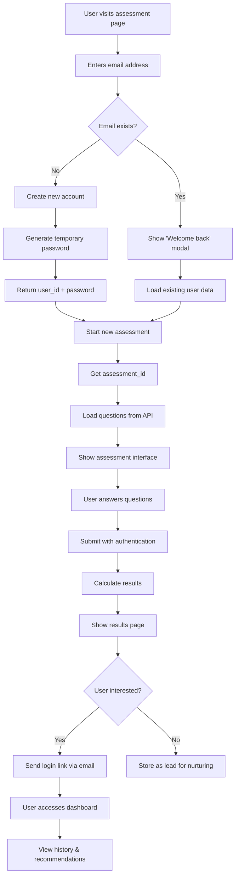

# Complete User Flow Documentation - Security Assessment Platform

## 🎯 Overview

This document describes the complete user flow for the Security Assessment Platform, including the seamless auto-login and authentication architecture.

## 🔐 Authentication Architecture

### User Account Creation
- **Endpoint**: `POST /api/v1/lead-capture/capture-lead`
- **Input**: `{"email": "user@example.com"}`
- **Output**: 
```json
{
  "user_id": "uuid-here",
  "temporary_password": "ABC123XYZ",
  "is_existing_user": false,
  "requires_password_change": true
}
```

### Authentication Requirements
- **No Auth Required**: Assessment start, question loading
- **Auth Required**: Assessment submission, results viewing, dashboard access
- **Credentials**: Email + temporary password from account creation

## 🚀 Complete User Flow



## 📊 Technical Flow Sequence

### 1. Frontend Email Submission
```javascript
// Step 1: Create customer account
const accountResult = await createCustomerAccount(email);
// Returns: {user_id, temporary_password, is_existing_user}

// Step 2: Start assessment  
const assessmentResult = await startAssessment(accountResult.user_id);
// Returns: {assessment_id, questions_count}

// Step 3: Load questions
const questionsData = await loadQuestions();
// Returns: {categories: [{questions: [...]}]}

// Step 4: Show assessment interface
showAssessment();
```

### 2. Assessment Submission (Authenticated)
```javascript
// User must authenticate with email + temporary_password
const token = await authenticate(email, temporary_password);

// Submit answers with authentication
const results = await submitAssessment({
  assessment_id: assessmentId,
  answers: userAnswers
}, token);
```

### 3. Results & Dashboard Access (Authenticated)
```javascript
// All dashboard endpoints require authentication
const dashboardData = await getDashboardData(token);
const assessmentHistory = await getAssessmentHistory(token);
```

## 🔧 Backend API Endpoints

### Public Endpoints (No Authentication)
- `POST /api/v1/lead-capture/capture-lead` - Create user account
- `POST /api/v1/assessment/start` - Start new assessment
- `GET /api/v1/assessment/data/full` - Load questions

### Protected Endpoints (Authentication Required)
- `POST /api/v1/assessment/submit` - Submit assessment answers
- `GET /api/v1/assessment/results/{id}` - Get assessment results
- `GET /api/v1/dashboard/*` - Dashboard access
- `POST /api/v1/login` - OAuth2 authentication

### Authentication Flow
```bash
# 1. Get JWT token
curl -X POST "http://localhost:8000/api/v1/login" \
  -H "Content-Type: application/x-www-form-urlencoded" \
  -d "username=user@example.com&password=ABC123XYZ"

# 2. Use token for protected endpoints
curl -X POST "http://localhost:8000/api/v1/assessment/submit" \
  -H "Authorization: Bearer <jwt_token>" \
  -H "Content-Type: application/json" \
  -d '{"assessment_id": "uuid", "answers": {...}}'
```

## 📧 Email Integration

### Login Link Generation
- **Endpoint**: `POST /api/v1/email/send-login-link`
- **Purpose**: Send seamless login links with embedded credentials
- **Template**: HTML email with secure login URL

### Email Simulation (Development)
```python
# When SMTP not configured, emails are logged:
logger.info(f"SIMULATED EMAIL TO: {email}")
logger.info(f"LOGIN LINK: {login_url}")
logger.info(f"CREDENTIALS: {email} / {password}")
```

## 🎨 Frontend Implementation

### Key JavaScript Methods
```javascript
class AssessmentApp {
  // Create user account and get credentials
  async createCustomerAccount(email) { ... }
  
  // Start assessment for user
  async startAssessment(userId) { ... }
  
  // Load questions from API
  async loadQuestions() { ... }
  
  // Submit with authentication
  async submitAssessment(data, token) { ... }
}
```

### Authentication State Management
```javascript
// Store authentication data
this.userId = accountResult.user_id;
this.assessmentId = assessmentResult.assessment_id;
this.temporaryPassword = accountResult.temporary_password;

// Use for authenticated requests
const token = await this.authenticate();
```

## 🔒 Security Considerations

### Password Security
- Temporary passwords are cryptographically secure (12+ characters)
- Passwords are hashed using bcrypt before storage
- Users are encouraged to change passwords after first login

### Session Management
- JWT tokens for stateless authentication
- Token expiration and refresh mechanisms
- Secure cookie handling for persistent sessions

### Data Protection
- User emails are validated and sanitized
- Assessment data is tied to authenticated users
- Results are only accessible by the user who took the assessment

## 🚀 Deployment Architecture

### Backend (FastAPI)
- **Location**: `f:\securityassessment\fastapi\`
- **Port**: 8000
- **Services**: PostgreSQL, Redis, SMTP (optional)

### Frontend (HTML/JS)
- **Location**: `f:\securityassessment\customer_frontend\`
- **Port**: 3000
- **Dependencies**: Tailwind CSS, Fetch API

### Docker Containers
```yaml
# Backend
services:
  web:
    build: .
    ports: ["8000:8000"]
  
  postgres:
    image: postgres:13
    
  redis:
    image: redis:alpine
```

## 📈 User Experience Flow

### New User Journey
1. **Landing** → Enter email → Account created automatically
2. **Assessment** → Answer questions → Submit with auto-authentication  
3. **Results** → View scores → Option to create dashboard account
4. **Follow-up** → Receive login link → Access dashboard seamlessly

### Returning User Journey
1. **Landing** → Enter email → "Welcome back" modal
2. **Assessment** → Continue or start new → Submit with existing auth
3. **Dashboard** → View history → Access recommendations

## 🔍 Testing & Validation

### Manual Testing Steps
1. Clear test users from database
2. Use fresh email address
3. Verify account creation response includes password
4. Confirm assessment start works without auth
5. Verify submission requires authentication
6. Test dashboard access with credentials

### API Testing Console
- Available at: `http://localhost:8000`
- Interactive forms for all endpoints
- Authentication testing capabilities
- Real-time status monitoring

## 📋 Next Steps

1. **Production SMTP** - Configure real email service
2. **Password Reset** - Implement forgot password flow  
3. **Social Login** - Add Google/Microsoft OAuth
4. **Mobile Optimization** - Responsive design improvements
5. **Analytics** - User behavior tracking and insights

---

*Last Updated: 2025-07-14*
*Version: 2.0 - Complete Authentication Architecture*
