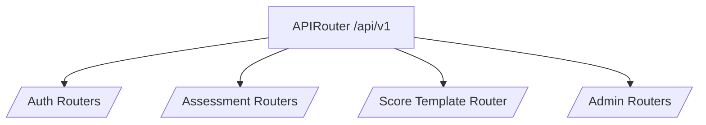

# <i class="fas fa-network-wired"></i> API Router v1 — Overview
Aggregates all versioned public and admin FastAPI routers under the `/api/v1` namespace.

**nb-NO:** Samler alle versjonerte offentlige og administrative FastAPI-rutere under `/api/v1`-navnerommet.

Source paths:
- `src/app/api/v1/__init__.py`

**SPOT:** ./SPOT.md#function-catalog

## API
- Instantiates `fastapi.APIRouter(prefix="/v1")`.
- Includes sub-routers for authentication, assessments, admin tooling, and the score template endpoints.
- Exposed upstream via `src/app/api/__init__.py` as part of the main FastAPI application.

## Design
- Router order groups general endpoints first, followed by assessment flows, and finally admin-specific routes to keep documentation organized.
- Sub-router inclusion retains their intrinsic prefixes (e.g. `/assessment`, `/score-templates`) for predictable URL paths.
- File-level comment and SPOT linkage satisfy the single-SPOT governance rules.

## Usage
```python
from app.api.v1 import router as v1_router

app_router = APIRouter(prefix="/api")
app_router.include_router(v1_router)
```

## Changelog
### 2025-09-24
- Documented router aggregation and added score template router inclusion.

## Diagrams

