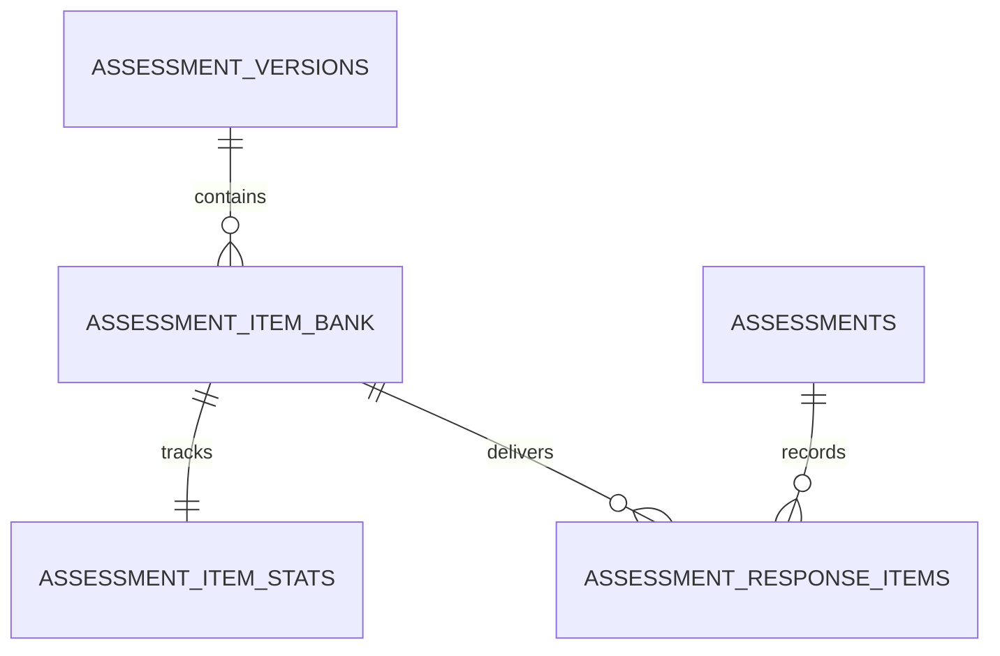

# Assessment Item Bank Models — Overview

**en:** SQLAlchemy models and Postgres schema powering blueprint-governed item banks, response linkage, and exposure statistics. Sources: `src/app/models/assessment_item_bank.py`, `seed_scripts/03_assessment_item_bank_schema.sql`.

**nb-NO:** SQLAlchemy-modeller og Postgres-skjema for blueprint-styrt spørsmålsbank, responskobling og eksponeringsstatistikk. Kildebaner: `src/app/models/assessment_item_bank.py`, `seed_scripts/03_assessment_item_bank_schema.sql`.

**SPOT:** ./SPOT.md#function-catalog

## API

- SQLAlchemy models:
  - `AssessmentVersion` — Links template IDs with blueprint names/versions.
  - `AssessmentItemBank` — Stores per-item difficulty, weights, anchors, and metadata.
  - `AssessmentResponseItem` — Persists rendered items, answers, and item-level scores per assessment attempt.
  - `AssessmentItemStats` — Tracks facility, discrimination, and exposure for rotation governance.
- Schema bootstrap: `seed_scripts/03_assessment_item_bank_schema.sql` creates tables, constraints, and indexes idempotently.

## Design

- Item lifecycle is scoped by `assessment_versions` so blueprint releases can rotate independently of assessments.
- JSONB columns hold tags, arbitrary metadata, and submitted answers for flexible reporting.
- Cascading deletes clear bank entries when a version is retired while response rows retain referential integrity via `RESTRICT`.
- Stats table centralises KPI inputs (facility, discrimination, exposure) used by the selector to prioritise low-exposure/high-signal items.
- Exposure caps are stored per item with optional overrides; selection helper merges real-time stats before sampling.

## Usage

```python
from sqlalchemy import select
from sqlalchemy.ext.asyncio import AsyncSession

from app.assessment_engine import pool_from_item_bank
from app.models.assessment_item_bank import AssessmentItemBank, AssessmentItemStats


async def load_pool(session: AsyncSession, version_id):
    records = (
        await session.execute(
            select(AssessmentItemBank).where(AssessmentItemBank.version_id == version_id)
        )
    ).scalars().all()

    stats = (
        await session.execute(
            select(AssessmentItemStats).where(AssessmentItemStats.item_id.in_([r.item_id for r in records]))
        )
    ).scalars().all()

    return pool_from_item_bank(records, stats)
```

**nb-NO:** Kjør `seed_scripts/03_assessment_item_bank_schema.sql` før bruk for å sikre tabellene finnes.

## Changelog

### [Unreleased]
- 2025-09-24: Introduced assessment version catalog, item bank, response link, and stats models + schema script.

## Diagrams


