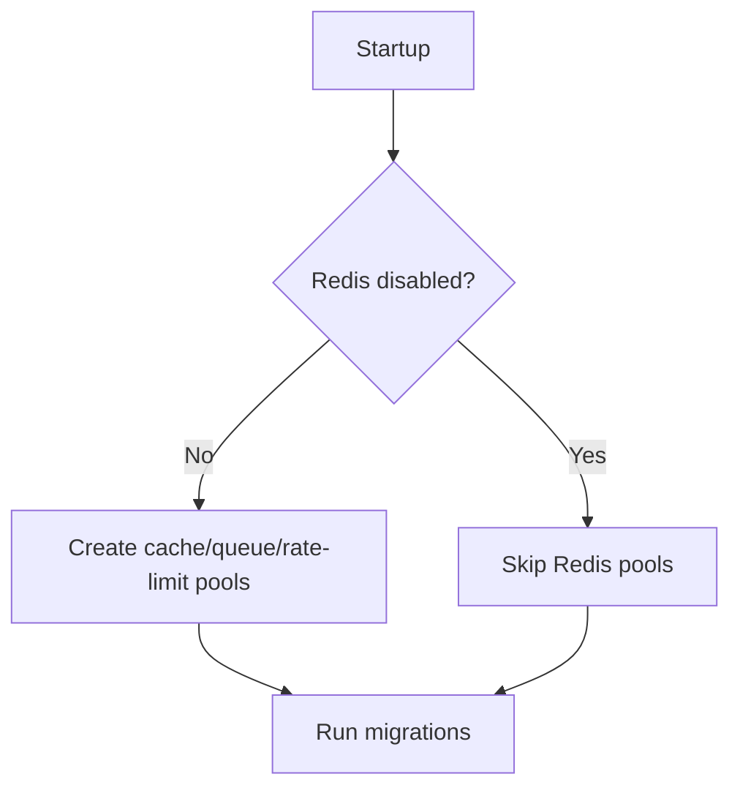

# <i class="fas fa-cogs"></i> Core Setup & Lifespan — Overview
Manages application startup, Redis pool initialization, and router wiring helpers.

**nb-NO:** Håndterer oppstart av applikasjonen, Redis-tilkoblinger og hjelpetjenester for rutere.

Source paths:
- `src/app/core/setup.py`

**SPOT:** ./SPOT.md#function-catalog

## API
- `create_application(router, settings, ...) -> FastAPI`
- `lifespan_factory(settings, create_tables_on_start=True)`
- Redis helper coroutines (`create_redis_cache_pool`, `create_redis_queue_pool`, etc.)

## Design
- Uses mixin settings classes to decide which pools to initialize during startup.
- Introduces `DISABLE_REDIS_FOR_TESTS` flag to bypass Redis connections for automated tests and offline development.
- Adds `DISABLE_DB_FOR_TESTS` to skip database table creation during ephemeral test runs.
- Keeps closing routines symmetric with startup hooks to avoid dangling connections.

## Usage
```python
from app.core.setup import create_application, lifespan_factory
from app.core.config import settings
from app.api import router

lifespan = lifespan_factory(settings)
app = create_application(router=router, settings=settings, lifespan=lifespan)
```

Set `DISABLE_REDIS_FOR_TESTS=1` to skip Redis queue/cache/rate-limit connections during tests.

## Changelog
### 2025-09-24
- Documented Redis bypass flag and linked module into SPOT.

## Diagrams

