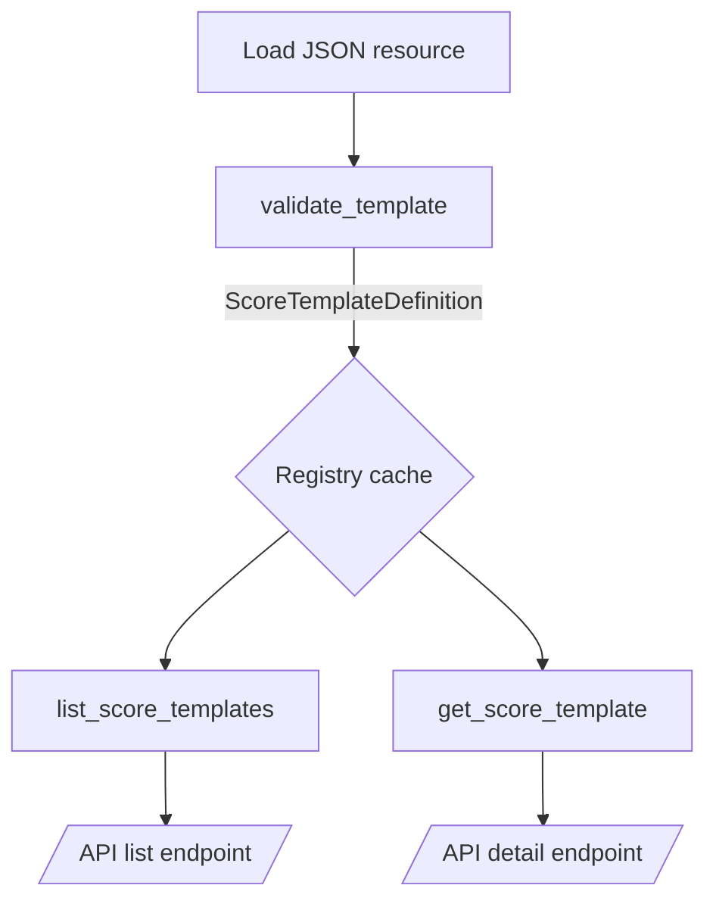

# <i class="fas fa-chart-gauge"></i> Score Template Registry — Overview
Centralized loader and validator for qualitative score templates backed by JSON Schema and Pydantic models.

**nb-NO:** Sentral innlasting og validering av skårmaler basert på JSON Schema og Pydantic-modeller.

Source paths:
- `src/app/score_templates/__init__.py`
- `src/app/score_templates/registry.py`
- `src/app/score_templates/schema.py`
- `src/app/score_templates/validation.py`
- `src/app/score_templates/definitions/performance_health_v1.json`
- `src/app/api/v1/score_templates.py`

**SPOT:** ./SPOT.md#function-catalog

## API
- Python: `list_score_templates() -> list[ScoreTemplateSummary]`
- Python: `get_score_template(template_id: str) -> ScoreTemplateDefinition | None`
- HTTP: `GET /api/v1/score-templates/`
- HTTP: `GET /api/v1/score-templates/{template_id}`

Responses use the `ScoreTemplateSummary` and `ScoreTemplateDefinition` Pydantic models to guarantee a consistent contract.

## Design
- Bundled templates live under `app.score_templates.definitions` and must satisfy `score_template.schema.json`.
- `validate_template` enforces JSON Schema compliance plus semantic checks (weight sum, bucket coverage, tip alignment).
- Registry cache (`functools.lru_cache`) avoids repeated disk reads while keeping a simple reload story for future extensibility.
- API router mirrors the assessment template endpoints to keep the public surface predictable.

## Usage
```python
from app.score_templates import list_score_templates

summaries = list_score_templates()
for summary in summaries:
    print(summary.key, summary.dimension_count)
```

```shell
$ curl http://localhost:8000/api/v1/score-templates/
```

## Changelog
### 2025-09-24
- Initial publication with schema validation, registry cache, FastAPI endpoints, and bundled performance template.

## Diagrams

