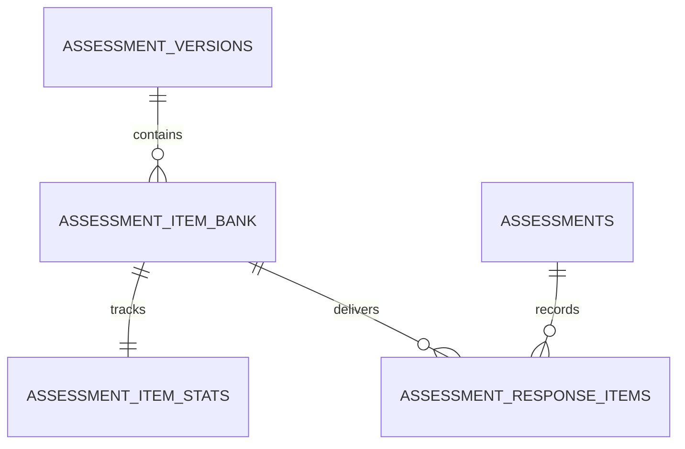

# Data Model Overview

**en:** Conceptual view of assessment versions, item bank governance, response linkage, and exposure statistics.

**nb-NO:** Konseptuelt diagram over vurderingsversjoner, spørsmålsbank-styring, responskobling og eksponeringsstatistikk.

Mermaid fallback

