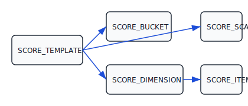
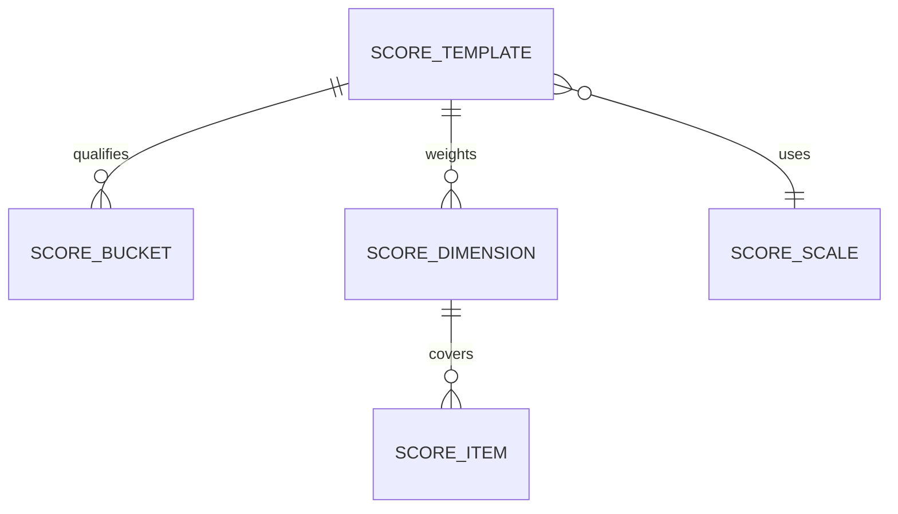

# Data Model Overview

**en:** Simplified entity diagram for score templates and related concepts.

**nb-NO:** Forenklet enhetsdiagram for skårmaler og tilhørende begreper.

Mermaid fallback

```mermaid
erDiagram
    SCORE_TEMPLATE ||--o{ SCORE_BUCKET : "qualifies"
    SCORE_TEMPLATE ||--o{ SCORE_DIMENSION : "weights"
    SCORE_DIMENSION ||--o{ SCORE_ITEM : "covers"
    SCORE_TEMPLATE }o--|| SCORE_SCALE : "uses"
```

